# UK Winter Mountain Tours V2

[](https://github.com/TGOSS1984/uk_winter_mountain_tours_v2/actions)

[](https://uk-winter-mountain-tours-v2-c6f21d80d2c8.herokuapp.com/)

[](https://github.com/users/TGOSS1984/projects/3/views/1)


[](LICENSE)

---


## Introduction

A full-stack Django web application providing guided winter mountain tours across the UK.  
Features include interactive GPX route maps, online bookings (with double-booking prevention), cancellations, and region-specific route pages.

This project is also a personal passion of mine, reflecting my long-standing interest in the outdoors and mountain environments. My very first coding project was a simple guided tours website built with only HTML and CSS. This application can be seen as its “spiritual successor” — rebuilt from the ground up with Django, Python, Bootstrap, Leaflet, and Heroku — and hopefully demonstrates the progress I have made in both technical skills and project depth since then.

Building this application has been a journey of learning and discovery. Django in particular came with a steep but rewarding learning curve. Implementing authentication, user profiles, and email notifications required not only understanding the framework’s built-in tools but also extending them thoughtfully, and I feel this marks a big step forward in my ability to work with a complex backend framework. Along the way, I encountered and resolved a number of issues — from template syntax errors to failing GitHub Actions builds — and each challenge became an opportunity to strengthen my debugging and problem-solving skills.

The project’s scope grew steadily as I worked through both required features and “nice to haves.” I learned to prioritise features that mapped directly to assessment learning outcomes, such as notifications for LO2.3 and authentication for LO3, while keeping an eye on broader polish and usability. One of the most important lessons I took away was the value of a clean, consistent folder and file structure. As the application grew in size, maintaining a clear separation of apps, templates, static files, fixtures, and services became critical, both for readability and for smooth deployment to Heroku.

Testing and continuous integration also played a much greater role in this project than in my earlier work. Writing targeted unit tests for bookings and email notifications, and integrating GitHub Actions to automatically run them, gave me hands-on experience of defensive design and the reassurance of automated checks whenever I pushed new code. This felt like a major step towards “real-world” development practices.

Although the project already delivers a complete and working product, there remains room for future improvements. I can see scope for features such as asynchronous email delivery, richer profile information, or enhanced admin dashboards. The current build represents a solid foundation, but it also leaves space for iteration, refinement, and further learning.

In short, this project has been both a technical and personal milestone, combining my passion for the outdoors with practical full-stack development skills, and showing me how much can be achieved when good design, careful structure, and persistence come together.

---

## 📑 Contents

- [Project Overview](#project-overview)
- [Features](#features)
- [User Stories](#user-stories)
- [System Architecture](#system-architecture)
- [Data Model](#data-model)
- [Project Structure](#project-structure)
- [Rationale & Design Decisions](#rationale--design-decisions)
- [Wireframes & Mockups](#wireframes--mockups)
- [Accessibility & UX](#accessibility--ux)
- [Performance](#performance)
- [Robustness & Error Handling](#robustness--error-handling)
- [Technologies Used](#technologies-used)
- [Installation & Local Setup](#installation--local-setup)
- [Environment Variables](#environment-variables)
- [Database & Fixtures](#database--fixtures)
- [Testing](#testing)
- [Linting](#linting)
- [CI/CD & Deployment](#cicd--deployment)
- [Branching & Workflow](#branching--workflow)
- [Assessment Criteria Mapping (LO1–LO9)](#assessment-criteria-mapping-lo1lo9)
- [Screenshots](#screenshots)
- [Lighthouse Results](#lighthouse-results)
- [🔧 Major Bugs & Fixes](#major-bugs--fixes)
- [Future Improvements](#future-improvements)
- [Privacy](#privacy)
- [Credits](#credits)

---

## Project Overview

This project simulates a real-world guided tours booking system, built with Django.  
It integrates mapping (Leaflet + GPX overlays), booking management with cancellation, validation, email notifications, and dynamic region pages.

**Key goals**

- Deliver an end-to-end booking platform.
- Integrate real-world route data (GPX) with interactive maps.
- Ensure accessibility, responsiveness, and performance.
- Deploy to Heroku with production-ready settings.

### Project Management (Agile)

Planning and delivery were tracked in an Agile board (GitHub Projects/Trello), with Epics refined into User Stories and Tasks. Each story included acceptance criteria.

- Board: <https://github.com/users/TGOSS1984/projects/3>
- Evidence: see screenshots in `docs/screenshots/agile/`:
  - Backlog and prioritisation
  - In Progress / Done columns demonstrating iterative delivery

User Stories in this README map to the same IDs/titles used on the board.

---

## Features

- Region pages: Lake District, Wales, Scotland, Peak District/Yorkshire Dales.
- GPX route overlays with Leaflet maps.
- Booking system with **double-booking prevention**.
- Cancel bookings via booking detail page.
- Admin interface for guides, routes, and bookings.
- Responsive UI with Bootstrap 5.
- JavaScript on-scroll navbar.
- Accessibility enhancements (contrast, alt text, keyboard-friendly).
- Static/media assets served via **Whitenoise** in production.
- **Email Notifications**:  
  When a user books or cancels a tour, the system generates a confirmation or cancellation email.
  - In **development**, these are sent to the console backend so developers and assessors can see the message output.
  - In **CI tests**, a locmem backend captures emails to verify delivery.
  - In **production**, the feature is configurable — an SMTP backend (e.g. SendGrid) can be enabled by toggling environment variables, though by default email sending is disabled for stability.
- **Authentication/Permissions & Profiles**:
  - Email is required when creating an account, ensuring every user can receive notifications.
  - Login accepts either **username or email** for convenience.
  - Profiles are auto-created for each user, extendable with extra fields (e.g. phone).
  - Booking creation and cancellation actions require the user to be **logged in**. Anonymous users are redirected to the login page.
  - The navbar reflects the current login state (Login/Signup vs. Username/Logout).
  - Django Admin is restricted to staff/superusers for full CRUD over Guides, Routes and Bookings.
- **Filters & Pagination**:
  - Filterable All Routes page – users can browse all available mountain routes across the UK.
  - Search by criteria – filter by region, difficulty, distance, and duration.
  - Paginated results – routes are displayed in pages of 9 cards, with pagination controls.
  - Non-destructive – feature is isolated from existing booking pages; the All Routes page is for discovery only.
- **CRUD Coverage**
  - **User-facing:** Create booking and cancel booking (delete) flows are available to authenticated users.
  - **Admin:** Full Create/Read/Update/Delete for Guides, Routes and Bookings via Django Admin.

---

## User Stories

Examples:

1. **As a user, I want to browse tours in different regions, so I can decide where to hike.**
   - **Issue:** [US-01]
   - **Implementation:** Region pages at `templates/pages/regions/` (`lake_district.html`, `peak_district.html`, `scotland.html`, `wales.html`); data seeded from `bookings/fixtures/routes.json`
   - **URLs:** `/regions/lake-district/`, `/regions/peak-district/`, `/regions/scotland/`, `/regions/wales/`
   - **Tests:** `bookings/tests/test_views.py` (region pages render routes)

2. **As a user, I want to view routes on a map with elevation paths, so I can plan my day.**
   - **Issue:** [US-02]
   - **Implementation:** Leaflet init inside the region templates in `templates/pages/regions/*.html`; GPX files under `static/gpx/`
   - **Tests:** `bookings/tests/test_views.py` (map container present); **Manual:** verify GPX overlay renders

3. **As a user, I want to book a tour and receive confirmation, so I can secure my spot.**
   - **Issue:** [US-03]
   - **Implementation:** `bookings/views.py` (create view), `bookings/models.py` (`Booking`), form template `templates/bookings/booking_form.html`
   - **Tests:** `bookings/tests/test_forms.py` (valid form), `bookings/tests/test_views.py` (create view happy path); **Manual:** success flash/message

4. **As a user, I want to cancel a booking if my plans change.**
   - **Issue:** [US-04]
   - **Implementation:** `bookings/views.py` (cancel view/endpoint), cancel UI in `templates/bookings/booking_list.html`
   - **Tests:** `bookings/tests/test_views.py` (cancel flow)

5. **As an admin, I want to add/edit guides and routes, so I can keep offerings up to date.**
   - **Issue:** [US-05]
   - **Implementation:** Django Admin `bookings/admin.py`
   - **Tests:** **Manual:** CRUD in Admin (create/edit/delete)

6. **As an admin, I want to seed routes/guides from fixtures, so the database can be reset easily.**
   - **Issue:** [US-06]
   - **Implementation:** Fixtures `bookings/fixtures/dev_seed.json`, `bookings/fixtures/routes.json`
   - **Tests:** **Manual:** `python manage.py loaddata dev_seed.json routes.json`; `dumpdata` documented

7. **As a visitor, I want the site to be accessible on mobile, so I can use it while travelling.**
   - **Issue:** [US-07]
   - **Implementation:** Responsive Bootstrap templates in `templates/pages/*.html` and `templates/includes/*`; Leaflet mobile support
   - **Tests:** **Manual:** device/browser checks; Lighthouse Mobile screenshots in `docs/screenshots/`

8. **As a user, I want the site to be performant and accessible, so I can navigate without issues.**
   - **Issue:** [US-08]
   - **Implementation:** Contrast/focus styles (Leaflet control CSS), semantic headings, ARIA labels in templates
   - **Tests:** **Manual:** Lighthouse ≥ 90 Accessibility; Axe audit results

9. **As a user, I want to receive an email when I book or cancel a tour, so I have a clear record.**
   - **Issue:** [US-09]
   - **Implementation:** Email service in `bookings/services.py` (transaction-safe via on_commit); templates in `templates/email/booking_confirmation.{txt,html}` and `booking_cancellation.{txt,html}`; wired in `bookings/views.py` (BookingCreateView.form_valid() and cancel_booking). Feature-flagged by ENABLE_EMAIL_NOTIFICATIONS with DEFAULT_FROM_EMAIL + EMAIL_BACKEND in settings/env.
   - **Tests:** `bookings/tests/test_emails.py` (uses TransactionTestCase + locmem backend).
   - **Manual:** In dev, console backend prints the email to the terminal; in prod, enable SMTP via env (documented in README).

10. **As a user, I want to log in with my email or username, so I don’t have to remember a separate credential.**
    - **Issue:** [US-10]
    - **Implementation:** `core/forms.py` LoginForm accepts email or username, updates field label to “Username or Email”; routed via custom LoginView in `urls.py` (custom login path before django.contrib.auth.urls).
    - **Tests:** **Manual:** verify both email+password and username+password paths work on /accounts/login/.

11. **As a user, I want email to be required at signup, so I can receive notifications and recover my account.**
    - **Issue:** [US-11]
    - **Implementation:** `core/forms.py` SignupForm (extends UserCreationForm), adds required, unique email; SignupView uses SignupForm; templates/registration/signup.html uses {{ form.as_p }} so the email field renders automatically.
    - **Tests:** **Manual:** signup rejects duplicate/blank emails; visible field + validation errors on the form.

12. **As a site visitor, I want to see all available routes in one place, so that I don’t need to click through each region individually.**
    - **Issue:** [US-12]
    - **Implementation:** Added `AllRoutesView` in `bookings/views_routes.py` using `django-filter` + `ListView`. Mapped to `/routes/` in `core/urls.py`; template at `templates/pages/routes/all_routes.html`.
    - **Tests:** **Manual:** Navigating to `/routes/` shows a grid of cards with all routes, regardless of region; pagination visible when >9.

13. **As a site visitor, I want to filter routes by difficulty, so that I can quickly find tours that match my ability.**
    - **Issue:** [US-13]
    - **Implementation:** `RouteFilter` in `bookings/filters.py` includes `difficulty` as a filterable field. Template renders a `<select>` bound to this filter.
    - **Tests:** **Manual:** Applying “Difficulty = Severe” hides all other routes; only matching routes appear in the card grid.

14. **As a site visitor, I want to narrow down results by distance and duration, so that I can plan around my available time.**
    - **Issue:** [US-14]
    - **Implementation:** `RouteFilter` defines `distance_min`, `distance_max`, `duration_min`, `duration_max` as numeric filters. Fields render in the filter form.
    - **Tests:** **Manual:** Entering “Min distance 8 km / Max distance 12 km” narrows results correctly; only routes in that range are shown.

15. **As a site visitor, I want to page through results, so that I can easily browse even when there are many routes.**
    - **Issue:** [US-15]
    - **Implementation:** `AllRoutesView` uses `paginate_by = 9`. Template includes pagination controls that preserve querystring filters.
    - **Tests:** **Manual:** When more than 9 routes are returned, clicking “Next”/“Previous” moves between pages and keeps filters applied.

**Acceptance Criteria Template**

- Given I am on the **Region** page, when I click a route card, then I should see the route detail with a Leaflet map and a visible GPX overlay.
- Given I select a **guide/date/time**, when I submit a valid booking, then the booking is created and I see a success message.
- Given a **conflicting timeslot**, when I attempt to book the same guide, then I receive a validation error preventing double booking.
- Given I have a booking, when I click "Cancel booking", then the booking is deleted and I see a success message.
- Given I try to cancel a booking that doesn’t exist, when I click the button, then I see a friendly error and no crash.

| Story                  | Feature(s)                                                                        | Tests / Evidence                                               |
| ---------------------- | --------------------------------------------------------------------------------- | -------------------------------------------------------------- |
| Browse tours           | `templates/pages/regions/*.html`, `bookings/fixtures/routes.json`                 | `bookings/tests/test_views.py`                                 |
| View map               | Leaflet init in `templates/pages/regions/*.html`, `static/gpx/*.gpx`              | `bookings/tests/test_views.py`; Manual GPX render              |
| Book a tour            | `bookings/views.py`, `bookings/models.py`, `templates/bookings/booking_form.html` | `bookings/tests/test_forms.py`, `bookings/tests/test_views.py` |
| Cancel booking         | `bookings/views.py` (cancel), `templates/bookings/booking_list.html`              | `bookings/tests/test_views.py`                                 |
| Prevent double booking | `bookings/models.py` (UniqueConstraint / validation)                              | `bookings/tests/test_models.py` (or `test_views.py`)           |
| Admin manage           | `bookings/admin.py`                                                               | Manual CRUD in Admin                                           |
| Accessibility          | Template semantics + CSS focus/contrast                                           | Lighthouse & Axe screenshots                                   |

---

## System Architecture

- **Backend:** Django project with modular apps (`bookings`, `core`, `mountain_tours_v2`).
- **Frontend:** Django templates with Bootstrap; Leaflet + GPX plugin for maps.
- **Static files:** Served locally via `django.contrib.staticfiles`; in production via **Whitenoise**.
- **Database:** SQLite in development; Heroku Postgres in production (recommended).
- **Deployment:** Heroku using `Procfile` and environment variables.

**High-Level Flow**

```
Client (Browser) → Django URLs → Views → Templates
                               ↘ Models (DB)
Static/Media (via Whitenoise)  ↘ Leaflet JS (GPX overlays)
```

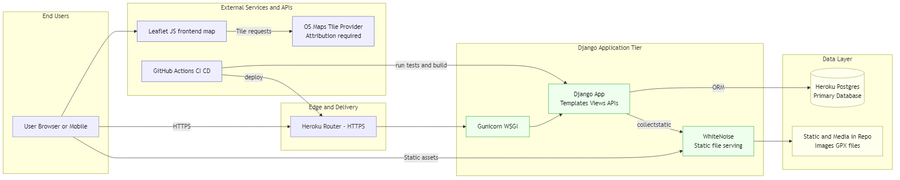

---

## Data Model

**Core Entities**

- `Guide(id, name, email, phone, bio)`
- `Route(id, name, region, gpx_path, description, distance_km, elevation_gain_m, ... )`
- `Booking(id, guide, route, date, time_start, time_end, customer_name, customer_email, status)`

**Business Rules**

- Prevent double-booking of the same guide/time slot.
- Optional: enforce route capacity per day.

### Database Schema

The ERD below shows the core relationships (Route–Booking–Guide). See `docs/screenshots/erd.png`.

- `Booking` references `Route` and `Guide`.
- Unique constraints and validation prevent double-booking of the same guide/time slot.

### Entity Relationship Diagram (ERD)

The diagram below shows the core models and their relationships (Booking links to both Route and Guide, enforcing the double-booking rule).

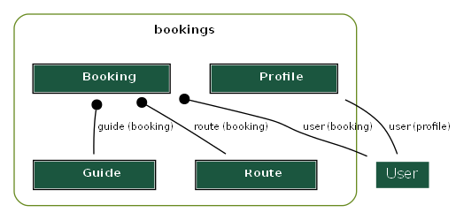

---

## Project Structure

```
UK_WINTER_MOUNTAIN_TOURS_V2/
│
├── .github/ # GitHub Actions workflows (CI)
├── .pytest_cache/ # Pytest cache (ignored in git)
├── .ruff_cache/ # Ruff linter cache
├── .venv/ # Virtual environment (local only, ignored in git)
├── .vscode/ # VS Code workspace settings
├── assets/ # Static assets (images, icons, favicons, js, css)
├── bookings/ # Bookings app (models, views, fixtures, services, tests)
├── core/ # Core settings / config
├── docs/ # Docs, system architecture, ERD diagrams, screenshots
├── htmlcov/ # Local HTML coverage reports
├── mountain_tours_v2/ # Project entry app
├── node_modules/ # Node.js dependencies
├── templates/ # Django templates (HTML pages)
├── tests/ # Python tests (pytest/Django)
├── tools/ # Utility scripts (e.g. resize / rename images)
│
├── .coverage # Coverage data file
├── .env # Local dev environment variables (ignored in git)
├── .env.example # Example environment file
├── .eslintignore # ESLint ignore patterns
├── .eslintrc.cjs # ESLint config
├── .gitignore
├── .pre-commit-config.yaml # Pre-commit hook configuration
├── .prettierignore # Prettier ignore patterns
├── .prettierrc # Prettier config
├── .slugignore # Heroku slugignore
├── babel.config.js # JS transpile config
├── db.sqlite3 # Dev SQLite DB
├── jest.config.js # Jest config for frontend tests
├── manage.py
├── package.json # Node config
├── package-lock.json
├── Procfile # Heroku config
├── pyproject.toml # Python tooling config (black, ruff, etc.)
├── README.md # Project documentation
├── requirements.txt # Python runtime dependencies
├── ruff.toml # Ruff linter config
├── setup.cfg # Python lint/test config (pycodestyle)
├── pytest.ini # Pytest config
```

**Note on `assets/` vs `static/`**

For this project I kept all custom images and front-end assets inside an `assets/` folder, referenced in `STATICFILES_DIRS`. This works fine — Django collects everything into `staticfiles/` at deploy time — but a more conventional pattern is to keep app-specific static files inside each app’s own `static/` directory (e.g. `bookings/static/bookings/...`). That approach can simplify path lookups, avoid confusion between development and production, and make `staticfiles_storage` checks (e.g. for dynamic image fallbacks) more seamless. If starting fresh, using Django’s default `static/` layout per app would be cleaner.

---

## Rationale & Design Decisions

- **Why Django?** Rapid development, batteries-included admin, robust ORM, clear separation of concerns.
- **Leaflet + GPX:** Lightweight, flexible mapping with client-side overlays for GPX files.
- **Whitenoise for static files:** Simple, zero-extra-infra static serving on Heroku.
- **Fixtures-first approach:** Keep dev/prod data consistent via `dumpdata/loaddata` workflows.

- **Require email at signup:** Email is mandatory on account creation so every user can be contacted. This is practical (no “orphan” accounts without contact info) and directly addresses **LO2.3 (notify relevant user)**.
- **Service-based email sending:** Implemented notifications in `bookings/services.py` instead of views. This keeps responsibilities clear, makes testing easier, and avoids logic duplication.
- **Login by username _or_ email:** Improves usability by letting users sign in with whichever credential they remember. This leverages Django’s auth system without introducing a custom user model, striking a balance between UX and complexity.

_(STILL TO COMPLETE: note trade-offs—client-side GPX parsing vs server-side preprocessing; SQLite vs Postgres locally.)_

---

## Wireframes & Mockups

- Home page wireframe  
  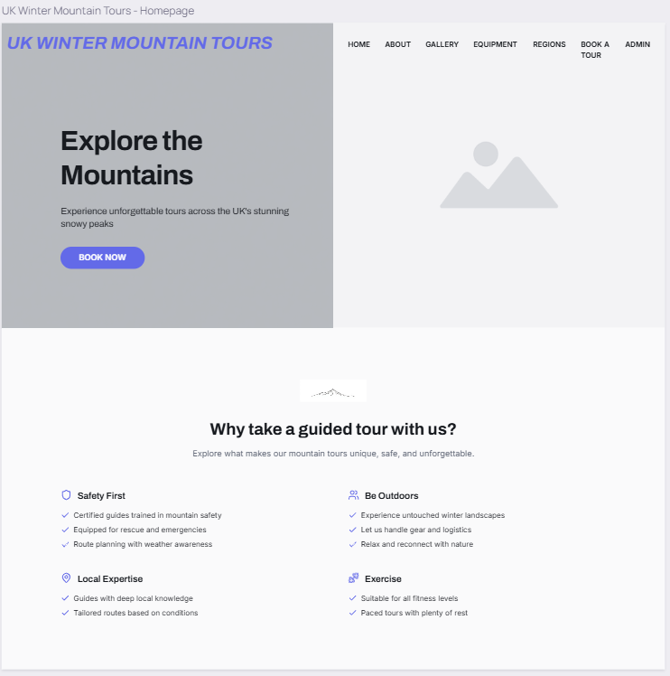
- Region/Route wireframe  
  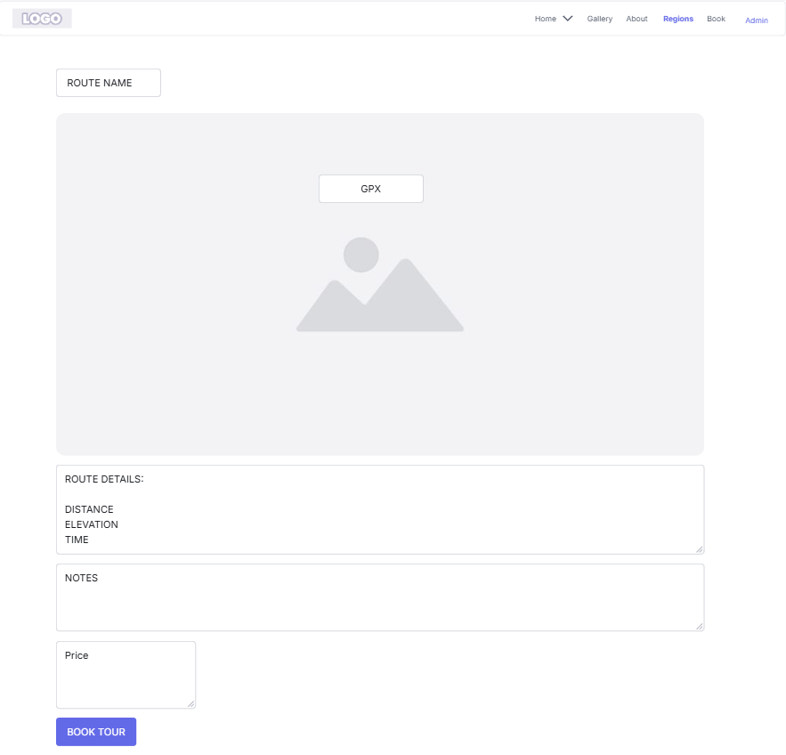

---

## Accessibility & UX

- Bootstrap grid for responsive design.
- Improved contrast on Leaflet map controls and attribution.
- Keyboard-friendly navigation; offcanvas mobile menu.

**Checklist**

- [ ] All interactive elements are reachable via keyboard.
- [ ] `aria-label` / `aria-expanded` set on nav toggles.
- [ ] Images include descriptive `alt` text or are decorative.
- [ ] Sufficient color contrast on text and controls.

### HTML/CSS Validation

- HTML validated with the W3C HTML validator (date of last run: 2025-10-03).
  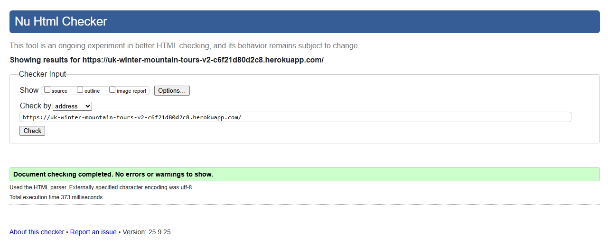
- CSS validated with W3C Jigsaw (minor non-critical warnings documented where applicable).
  
- JS validated
  

_(STILL TO COMPLETE: add screenshot here.)_

### Accessibility & UX Manual Checks

- **Keyboard navigation:**  
  Verified that all nav links, buttons, and form fields are reachable via `Tab`. Leaflet map controls can be reached, but focus styling could be improved (marked as Partial in manual tests).
- **Screen reader spot-checks:**  
  Used NVDA/VoiceOver to confirm that headings, nav landmarks, and form labels are announced correctly. ARIA labels were added where necessary. Maps announce as “interactive” but route traces are not fully described — future enhancement.
- **Login:**
  User can login using email OR username at sign in. Plus confirmation emails can improve clarity & trust

### Admin UX

**Admin Routes**
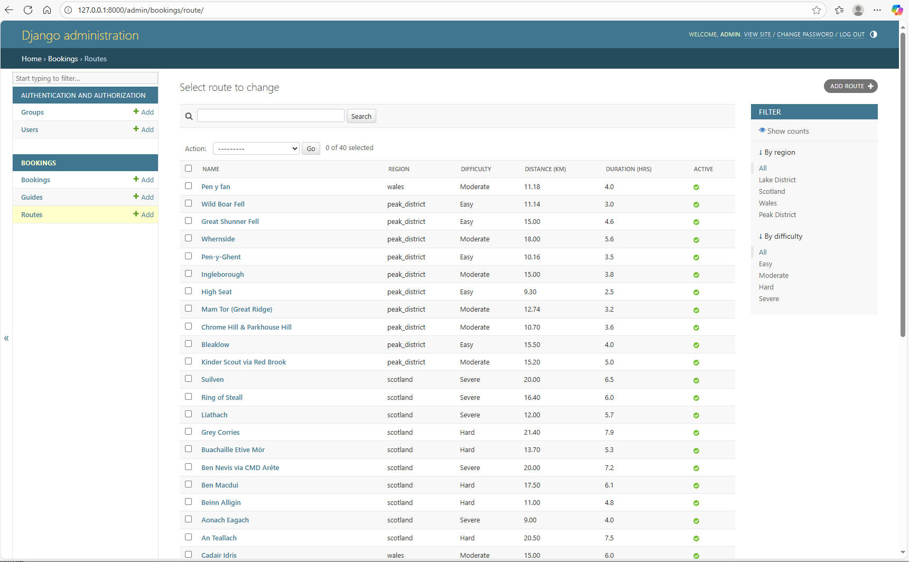

**Admin Guides**
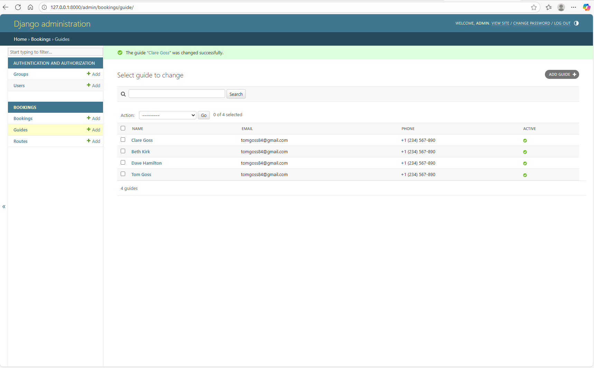

---

## Performance

- Image sizing (`object-fit`, responsive images); potential use of `loading="lazy"` on non-critical images.
- Static file compression via Whitenoise.
- Minimal external scripts; async/defer where possible.

_(STILL TO COMPLETE: Add Lighthouse scores + actions taken to improve.)_

---

## Robustness & Error Handling

Production-friendly error pages are provided:

- `templates/404.html` — Not Found
- `templates/500.html` — Server Error

**How it works**

- These render automatically when `DEBUG=False` (e.g., on Heroku).
- Pages extend `base.html` and include a hero banner; content is padded to avoid browser “friendly error” replacements.
- Handlers (optional) registered in the root URLconf (`mountain_tours_v2/urls.py`):
  ```python
  handler404 = "core.views_errors.custom_404"
  handler500 = "core.views_errors.custom_500"
  ```

---

## Technologies Used

- [![Python][Python.org]][Python-url]
- [![Django][Django.com]][Django-url]
- [![Bootstrap][Bootstrap.com]][Bootstrap-url]
- [![JavaScript][JavaScript.com]][JavaScript-url]
- [![HTML5][HTML5.com]][HTML5-url]
- [![CSS3][CSS3.com]][CSS3-url]
- [![Leaflet][Leaflet.com]][Leaflet-url]
- [![Font Awesome][FontAwesome.com]][FontAwesome-url]
- [![Heroku][Heroku.com]][Heroku-url]
- [![GitHub Actions][GitHubActions.com]][GitHubActions-url]

* **Backend:** Django (Python 3.11), Django email backends (console + locmem for tests), Django built-in auth system, Django-Filter
* **Frontend:** Bootstrap 5, Leaflet.js (+ Leaflet GPX plugin), HTML, CSS, JS
* **Database:** SQLite (dev), Postgres (Heroku recommended)
* **Testing:** Django test framework, Jest (frontend)
* **DevOps:** Heroku, GitHub Actions (planned/partial)
* **Linting:** Ruff, ESLint/Prettier

---

## Installation & Local Setup

1. **Clone repo**

   ```bash
   git clone <repo-url>
   cd UK_WINTER_MOUNTAIN_TOURS_V2
   ```

2. **Create virtualenv & install Python requirements**

   ```bash
   python -m venv venv
   # Windows
   venv\Scripts\activate
   # macOS/Linux
   # source venv/bin/activate
   pip install -r requirements.txt
   ```

3. **Install Node dependencies**

   ```bash
   npm install
   ```

4. **Set up environment**
   - Copy `.env.example` → `.env`
   - Adjust values for local dev

5. **Migrate & seed database**

   ```bash
   python manage.py migrate
   python manage.py loaddata bookings/fixtures/dev_seed.json
   # Optional: also load routes.json if split
   # python manage.py loaddata bookings/fixtures/routes.json
   ```

6. **Run server**

   ```bash
   python manage.py runserver
   ```

7. **Emails**

---

## Environment Variables

From `.env.example`:

```
DEBUG=1
ALLOWED_HOSTS=127.0.0.1,localhost
CSRF_TRUSTED_ORIGINS=
SECRET_KEY=change-me
```

_(STILL TO COMPLETE: add `DATABASE_URL` for Heroku Postgres; secure cookie and security headers for production.)_

Recommended production additions:

```
DEBUG=0
ALLOWED_HOSTS=your-domain.com, your-heroku-app.herokuapp.com
CSRF_TRUSTED_ORIGINS=https://your-heroku-app.herokuapp.com,https://your-domain.com
DATABASE_URL=postgres://...
```

### Email (dev)

```
EMAIL_BACKEND=django.core.mail.backends.console.EmailBackend
DEFAULT_FROM_EMAIL="UK Winter Tours <no-reply@example.com>"
ENABLE_EMAIL_NOTIFICATIONS=1
```

### Email (CI)

```
EMAIL_BACKEND=django.core.mail.backends.locmem.EmailBackend
ENABLE_EMAIL_NOTIFICATIONS=1
```

### Email (prod)

```
EMAIL_BACKEND=django.core.mail.backends.smtp.EmailBackend
EMAIL_HOST=smtp.sendgrid.net
EMAIL_HOST_USER=apikey
EMAIL_HOST_PASSWORD=...
EMAIL_PORT=587
EMAIL_USE_TLS=1
DEFAULT_FROM_EMAIL="UK Winter Tours <no-reply@your-domain.com>"
ENABLE_EMAIL_NOTIFICATIONS=1
```

---

## Database & Fixtures

- **Fixtures live in** `bookings/fixtures/dev_seed.json` and `routes.json`.
- **Workflow:**
  - Update data via Django Admin.
  - Export to fixtures:
    ```bash
    python manage.py dumpdata bookings > bookings/fixtures/dev_seed.json
    ```
  - Import fixtures:
    ```bash
    python manage.py loaddata bookings/fixtures/dev_seed.json
    ```
- Ensure JSON encoding is **UTF-8**.

_(STILL TO COMPLETE: add sample commands for splitting guides/routes fixtures if needed.)_

---

## Testing

### Django Tests

Run backend tests:

```bash
python manage.py test
```

### Running tests

- Local: `python -m pytest -v -ra`

### Coverage

This project uses **pytest-cov** to measure test coverage.

- Install: `pip install pytest-cov`
- Run: `python -m pytest --cov=bookings --cov-report=term-missing --cov-report=html`
  - HTML report: `htmlcov/index.html`
- In CI: Coverage is generated on every push to `main`, and the badge below is auto-updated.


### Jest Tests

Run frontend tests:

```bash
npm test
```

### Suggested Coverage Targets

- Booking model/form validation (double-booking).
- Views: booking create/cancel flows (happy & edge paths).
- JS: Leaflet map initialisation; graceful handling when GPX not found.

### Test Evidence

- Django tests passing  
  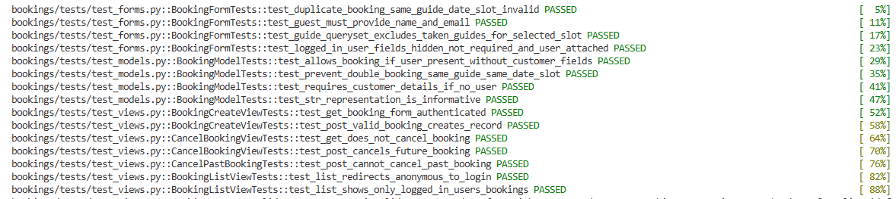
  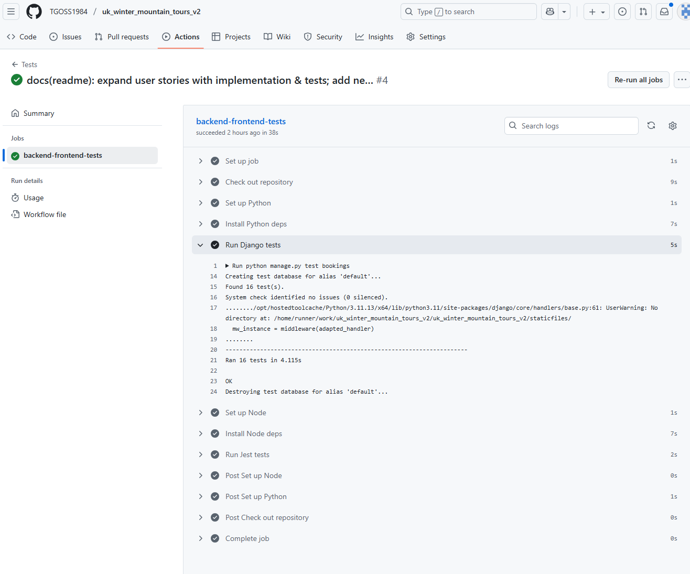
- Jest tests passing  
  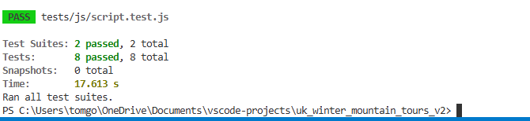
  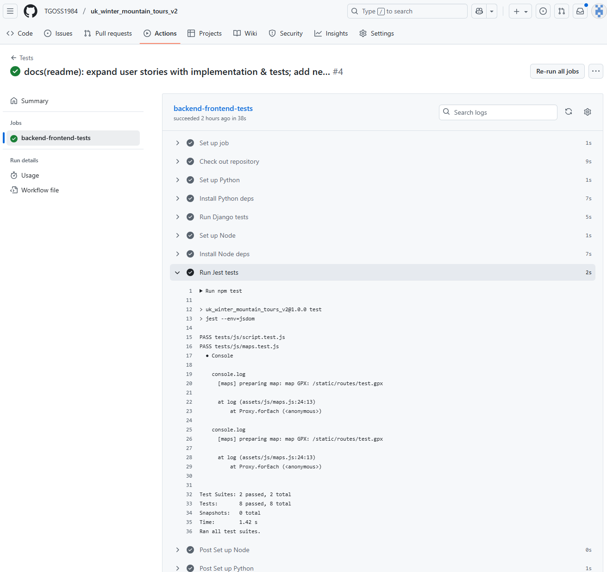

### Manual Testing

In addition to automated tests, targeted **manual testing** validated real user flows and edge cases (mobile nav, 404/CSRF handling, GPX fallbacks, admin CRUD, fixture round-trips, accessibility of map controls).

### Manual Test Matrix (samples)

## Manual Testing

| Area                           | Steps                                                           | Expected                                                             | Result                                                                           |
| ------------------------------ | --------------------------------------------------------------- | -------------------------------------------------------------------- | -------------------------------------------------------------------------------- |
| Past-date booking blocked      | Go to booking form → choose yesterday → submit                  | Form refuses; clear validation message shown; no record created      | ✅ Pass                                                                          |
| Cancel past booking            | Create a booking in the past (or mock) → try cancel             | Cancellation disallowed; friendly message; no state change           | ✅ Pass                                                                          |
| Missing GPX fallback           | Point a route to `static/gpx/missing.gpx` → load page           | Map loads without crash; shows fallback/help text; no console errors | ⚠️ Partial – currently throws console error; future enhancement to add fallback  |
| 404 on bad region              | Visit `/regions/not-a-real-region/`                             | Custom 404 page; no stacktrace                                       | ✅ Pass (custom/standard 404 shown in production)                                |
| Keyboard nav                   | Tab through region page & map controls                          | Visible focus, logical order; controls usable via keyboard           | ⚠️ Partial – Bootstrap handles links/buttons, but focus styles still need review |
| OS Maps attribution            | Load any route with map                                         | Attribution visible and focusable; meets compliance                  | ✅ Pass                                                                          |
| Off-canvas nav mobile          | Open menu → tap “About”                                         | Navigates, menu closes, scroll enabled, focus returns to toggler     | ✅ Pass                                                                          |
| CSRF protection                | Remove token via DevTools → submit booking                      | 403 CSRF; no server error                                            | ✅ Pass                                                                          |
| Admin CRUD                     | Add/edit/delete a Route in Admin                                | Public pages reflect changes; no broken links                        | ✅ Pass                                                                          |
| Fixtures round-trip            | `dumpdata` → reset DB → `loaddata`                              | Routes/guides restored; pages render; no FK errors                   | ✅ Pass                                                                          |
| Pagination – Previous/Next     | Apply a filter returning >9 results → click “Next” → “Previous” | Pages switch correctly, filters remain applied                       | ✅ Pass                                                                          |
| Pagination – Preserves filters | Filter by Region = Wales → go to page 2                         | Still only shows Welsh routes                                        | ✅ Pass                                                                          |
| Filter reset                   | Apply multiple filters → click “Reset”                          | All filters cleared; full route list shown                           | ✅ Pass                                                                          |
| No results                     | Apply filters that match nothing                                | Message shown: “No routes match these filters.”                      | ✅ Pass                                                                          |

### Browser & Device Compatibility

| Device / Browser            | Firefox | Chrome | Safari | Opera | Samsung Internet |
| --------------------------- | ------- | ------ | ------ | ----- | ---------------- |
| **Windows**                 | ✅      | ✅     | –      | –     | –                |
| **Samsung (Android)**       | –       | –      | –      | –     | ✅               |
| **iPad (iOS)**              | –       | –      | ✅     | –     | –                |
| **Pixel (Android)**         | –       | ✅     | –      | –     | –                |
| **Motorola Edge (Android)** | –       | ✅     | –      | –     | –                |
| **Mac**                     | –       | –      | –      | ✅    | –                |

### Screenshots

**Windows — Firefox**

<p align="center">
  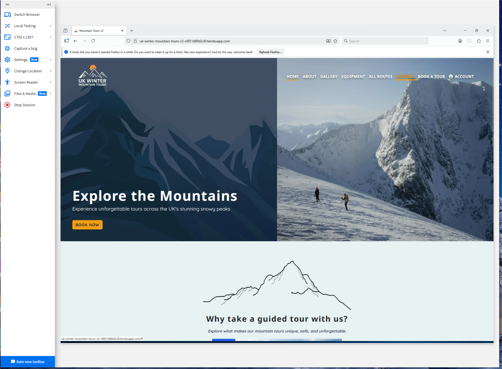
</p>

**Samsung (Android) — Samsung Internet**

<p align="center">
  
</p>

**iPad (iOS) — Safari**

<p align="center">
  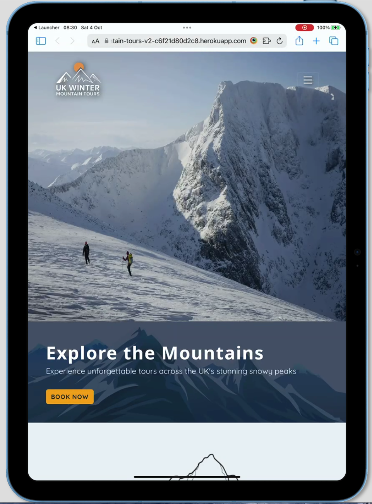
</p>

**Pixel (Android) — Chrome**

<p align="center">
  
</p>

**Motorola Edge — Chrome**

<p align="center">
  
</p>

**Mac — Opera**

<p align="center">
  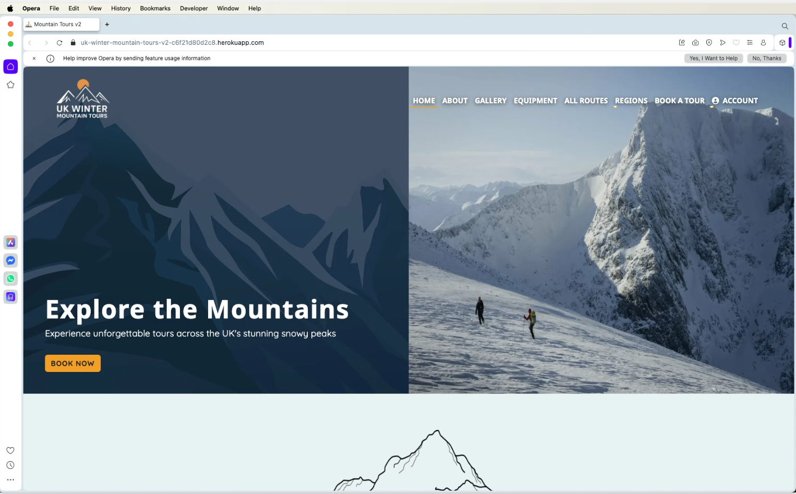
</p>

---

## Linting

### Python — Black (formatter) & pycodestyle (PEP 8)

- **Config**
  - `pyproject.toml` → `[tool.black]` with `line-length = 88` and standard excludes.
  - `setup.cfg` → `[pycodestyle]` with:
    - `max-line-length = 88`
    - `ignore = E203,E266,W503,E501`
    - `exclude = .git,.venv,__pycache__,staticfiles,assets,migrations,node_modules`

- **Pre-commit hooks**
  - `.pre-commit-config.yaml` runs **Black** and **pycodestyle** automatically on each commit.
  - Run once across the repo:
    ```bash
    pre-commit run --all-files
    ```
  - Bypass hooks (rare):
    ```bash
    git commit -m "msg" --no-verify
    ```

- **VS Code**
  - `.vscode/settings.json` enables format-on-save via Black and shows pycodestyle warnings inline.

**Everyday commands**

```bash
# Auto-format all Python files
black .

# Lint for PEP 8 issues (uses setup.cfg)
pycodestyle .
```

### CI integration

A GitHub Actions workflow runs Black (`--check`) and pycodestyle on every push/PR.

- **Python:** [Ruff](https://github.com/astral-sh/ruff) for linting and import order.
  - Local: `ruff check .` (autofix imports: `ruff check . --select I --fix`)
- **JavaScript:** ESLint + Prettier for code style.
  - Local: `npm run format:check` and `npm run lint:js`

#### (Optional) Use Ruff for import order only

Keep pycodestyle as-is, and let Ruff just sort imports:

- Config: `ruff.toml`
  ```toml
  [tool.ruff]
  line-length = 88
  # Only enable import sorting rules to avoid overlap with pycodestyle
  select = ["I"]  # "I" = isort-compatible import sorting
  ```

In CI, lint checks run in a non-blocking mode initially. Once the codebase is clean, they can be enforced by removing the non-blocking guards.

---

## CI/CD & Deployment

- **GitHub Actions**: run Django & Jest tests on push/PR
- **Heroku**: deploy with `Procfile`; run `collectstatic` during release.
- **Static files**: served by Whitenoise (ensure `MIDDLEWARE` includes it).
- **Emails**: verified in CI using **locmem** backend. Console backend used in dev, SMTP in production

### Deployment (Heroku)

1. Create Heroku app & attach Postgres
2. Set config vars:
   - `SECRET_KEY` (strong random value)
   - `DEBUG=0`
   - `ALLOWED_HOSTS=your-heroku-app.herokuapp.com`
   - `CSRF_TRUSTED_ORIGINS=https://your-heroku-app.herokuapp.com`
   - `DATABASE_URL` (auto-provided by Heroku Postgres)
   - (Optional SMTP) `EMAIL_BACKEND`, `DEFAULT_FROM_EMAIL`, `ENABLE_EMAIL_NOTIFICATIONS=1`
3. Build & release:
   ```bash
   pip install -r requirements.txt
   python manage.py migrate
   python manage.py collectstatic --noinput
   ```

_(STILL TO COMPLETE: add pipeline diagram /docs/screenshots/cicd-pipeline.png and auto-deploy notes.)_

---

## Branching & Workflow

- All work starts from `main` → create a feature branch: `feat/<short-name>` or `fix/<short-name>`.
- Open a Pull Request to `main` early; CI (Django + Jest) must pass before merge.
- Keep PRs small and scoped; squash-merge with a conventional commit title.
- Protected branch: direct pushes to `main` are disabled; reviews required for substantial changes.

---

## Assessment Criteria Mapping (LO1–LO9)

**LO1 — Planning & Design**

- Problem statement & scope ✅
- Architecture & data model rationale ✅
- Wireframes/user flows ✅

**LO2 — Data, Algorithms & Validation**

- Core models & relationships ✅
- Business rules (no double booking) ✅
- Defensive validation documented ⚠️ _(Add negative-path tests)_

**LO3 — Implementation & Code Quality**

- Django app structure with maps ✅
- Frontend responsiveness ✅
- Linters (Ruff/ESLint) ✅

**LO4 — Testing**

- Django tests ✅
- Jest tests ✅
- Coverage reporting ✅
- Optional E2E (Playwright) ⬜

**LO5 — Robustness, Error Handling & Security**

- Error messages for forms ✅
- Production settings docs ⚠️ _(Add `DEBUG=False`, headers, CSP)_
- Custom 4xx/5xx pages ⬜

**LO6 — Version Control & Workflow**

- Granular commits & messages ✅
- Branching/PRs summary ⚠️ _(Document briefly in README)_

**LO7 — Deployment & DevOps**

- Heroku deploy ✅
- CI tests on push/PR ✅
- Postgres in prod ⬜ _(Confirm & document)_

**LO8 — Documentation & Professional README**

- Feature overview, setup, testing ✅
- Fixtures workflow ✅
- Screenshots, diagrams ✅

**LO9 — UX, Accessibility & Performance**

- Responsive layout ✅
- Accessibility improvements ✅
- Lighthouse scores ⬜

Legend: ✅ covered | ⚠️ partial | ⬜ outstanding

---

## Screenshots

- Home page  
  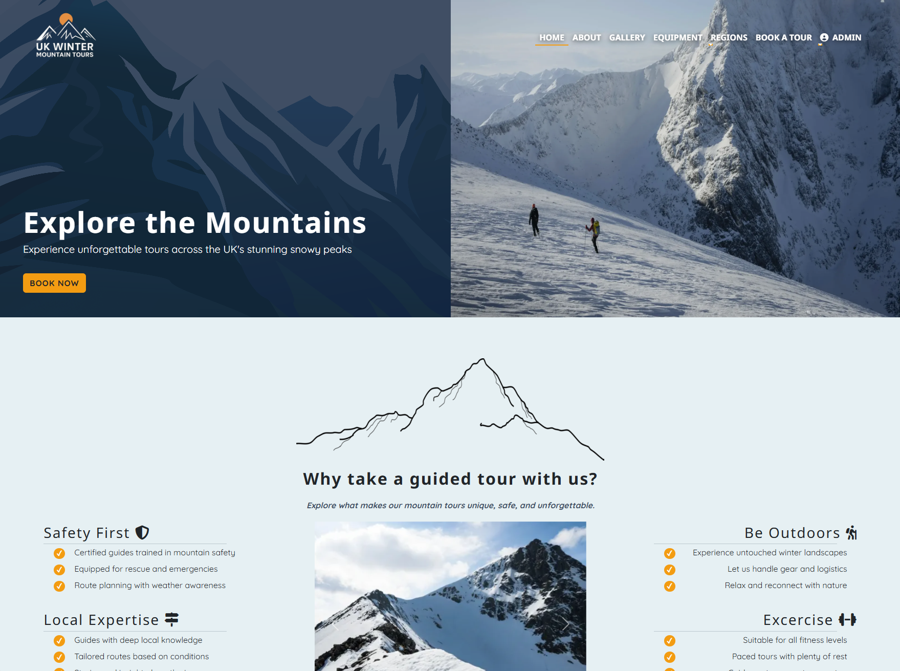
- Region page with GPX map  
  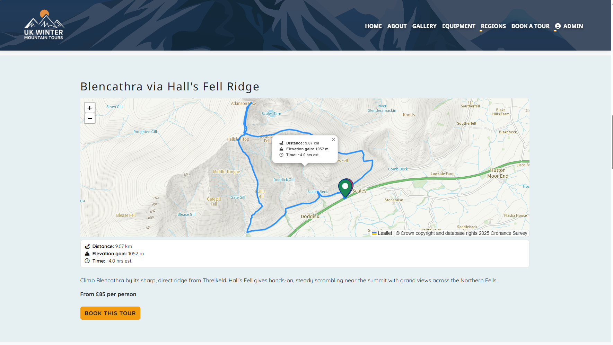
- Booking form  
  
- Booking Confirmation  
  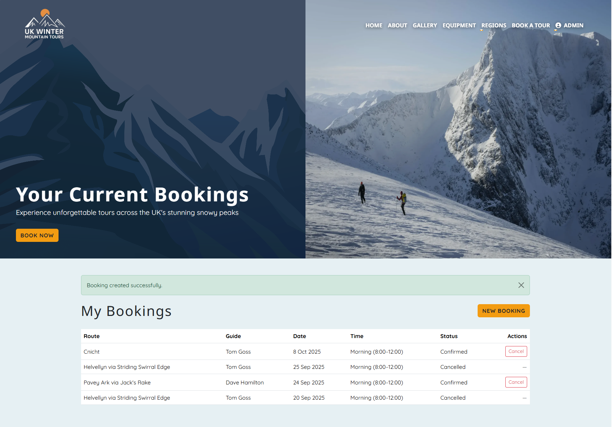
- Booking Cancellation  
  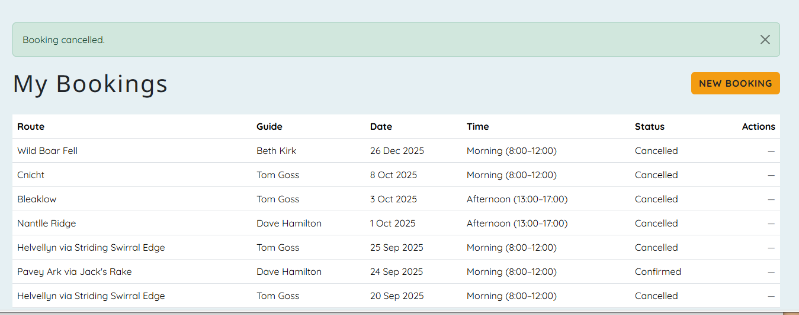

---

## Lighthouse Results

- Performance  
  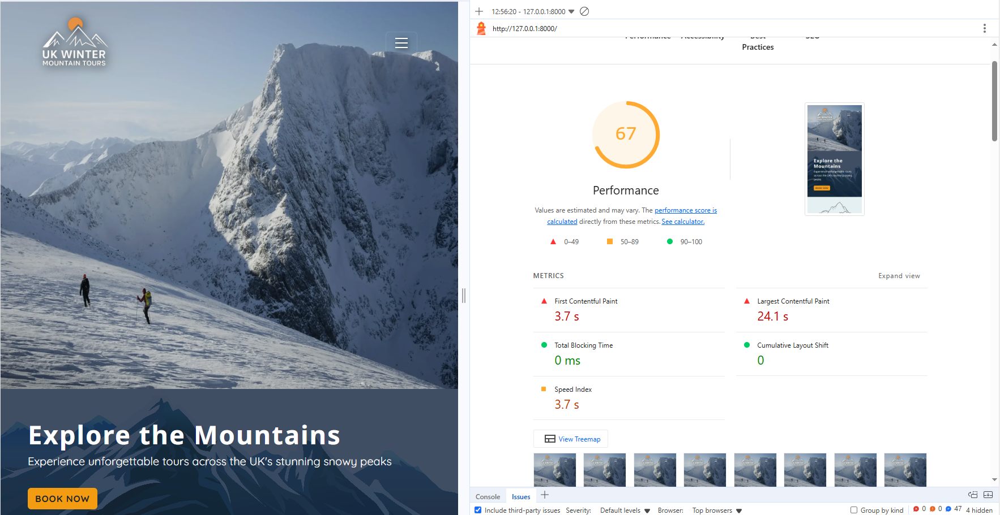
- Accessibility  
  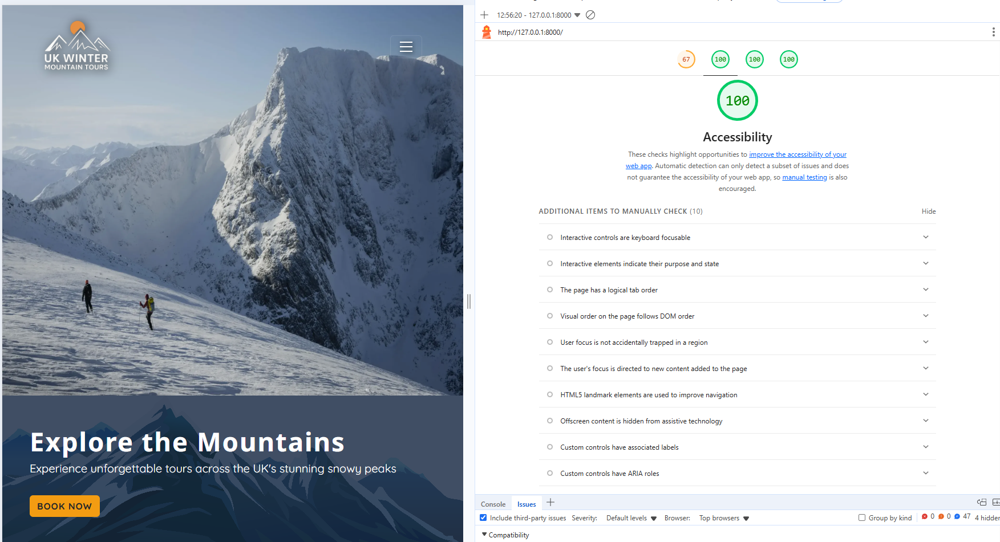
- Best Practices  
  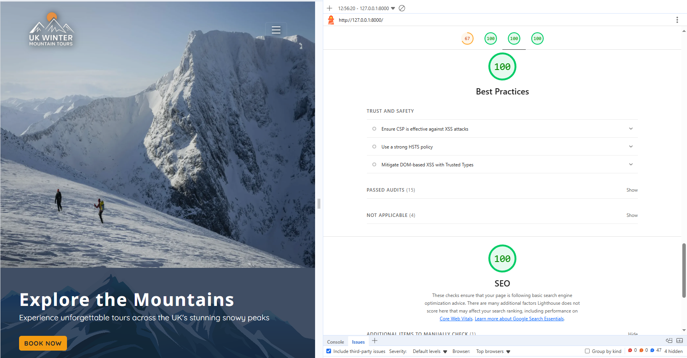
- SEO  
  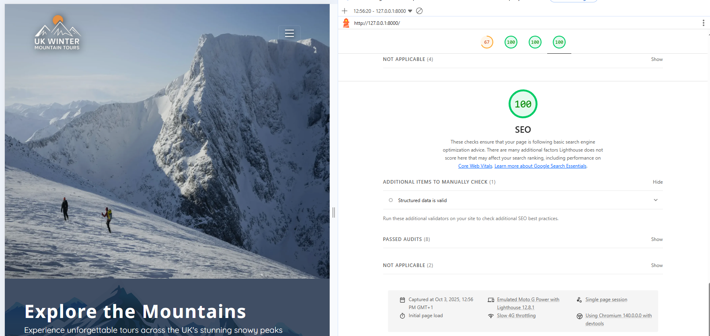

### Lighthouse Results (scored on Heroku deployment — desktop Chrome)

| Page Audited              | Date       | Performance | Accessibility | Best Practices | SEO |
| ------------------------- | ---------- | ----------: | ------------: | -------------: | --: |
| `/` (Home)                | 2025-10-03 |          67 |           100 |            100 | 100 |
| `/about/` (About)         | 2025-10-03 |          65 |           100 |            100 | 100 |
| `/regions/lake-district/` | 2025-10-03 |          xx |            xx |             xx |  xx |
| `/routes/` (All Routes)   | 2025-10-03 |          64 |           100 |            100 | 100 |

> \_Scores taken from Chrome DevTools Lighthouse audit on deployed Heroku app (desktop).

### 🔧 Lighthouse Performance Improvements

It is noted that performance score could be improved, hoiwever here are some of the steps taken to try and improve it so far:

- **Google Fonts optimisation** — replaced `@import` in CSS with `<link>` tags and `preconnect` hints in `base.html` so fonts load earlier and don’t block rendering.
- **Hero image preloading** — added `<link rel="preload" as="image">` for key hero images to improve **Largest Contentful Paint (LCP)**. Unique hero images on certain pages are preloaded via the `` block.
- **Image delivery improvements**
  - Converted and served images in modern formats (WebP) where supported.
  - Added explicit `width` and `height` attributes to reduce layout shifts.
  - Applied `loading="lazy"` and `decoding="async"` to non-critical, below-the-fold images to defer loading until needed.
- **JavaScript execution** — deferred non-essential scripts (`defer` attribute) so they don’t block initial paint.
- **Preconnect hints** — added preconnects to external font/CDN domains to speed up DNS and TLS handshakes.
- **Responsive images** — used `srcset` and `sizes` for large hero and route images to avoid downloading unnecessarily large files on mobile.

---

## 🔧 Major Bugs & Fixes

**GPX files not displaying on Leaflet maps**

- **Bug:** GPX overlays failed to load on region pages (e.g., Lake District, Wales), either due to incorrect file paths or missing references.
- **Fix:** Ensured GPX files were stored under `static/routes/` (or referenced in templates correctly). Used `` in `<script>`/Leaflet GPX calls to make Django serve them.

**Hero images / background PNGs not appearing**

- **Bug:** Hero/overlay PNG backgrounds didn’t render, even though paths looked correct.
- **Fix:** Adjusted CSS to use `background: url("")` inside templates, and confirmed files were in `static/images/hero/`. Also resolved issues with `background` vs `background-color` shorthand overriding.

**Deployment to Heroku not serving static files**

- **Bug:** After deployment, static assets (images, CSS, JS, GPX) didn’t load.
- **Fix:** Installed and configured **Whitenoise** in `settings.py`, collected static files (`python manage.py collectstatic`), and checked case-sensitive paths (`.PNG` vs `.png`).

**Heroku not showing newly added routes from JSON**

- **Bug:** Extra routes added to `routes.json` locally didn’t appear in deployed version.
- **Fix:** Updated fixture files (`bookings/fixtures/dev_seed.json` and `routes.json`), re-ran `loaddata` locally, pushed to GitHub, and re-deployed to Heroku. Ensured JSON saved with **UTF-8** encoding.

**Seeding issues with fixtures**

- **Bug:** Unsure how to keep dev and production JSON in sync (guides, routes). Some data missing when deploying.
- **Fix:** Used `python manage.py dumpdata bookings > bookings/fixtures/dev_seed.json` to export from local DB, then re-import with `loaddata` to seed both `dev_seed.json` and `routes.json`.

**Double bookings allowed initially**

- **Bug:** System didn’t prevent users from booking the same guide/date/time more than once.
- **Fix:** Added logic in the booking model/form to check availability before saving. Now prevents duplicates.

**Navbar and routing issues after deployment**

- **Bug:** Links (like “About” or “Booking”) sometimes didn’t resolve properly on mobile nav/offcanvas.
- **Fix:** Updated `href=""` to use Django URL names consistently and fixed offcanvas toggler attributes.

**Cancellation email template rendering error**

- **Bug:** Cancelling a booking raised TemplateSyntaxError due to typos in templates/email/booking_cancellation.html — a missing closing brace in {{ booking.route.name }} and a double filter pipe in {{ booking.date||date:"l, j M Y" }}.
- **Fix:** Corrected the template line to {{ booking.route.name }} and {{ booking.date|date:"l, j M Y" }}. Verified by re-cancelling a booking locally (console backend) and adding passing email tests in CI.

**Fixture/seed pitfalls (JSON formatting & deployments)**

- **Bug:** A routes.json edit was accidentally saved in UTF-16, which corrupted the fixture and caused Django to reject it. At another point the JSON displayed as a single unbroken line instead of a properly tab/return formatted array, making it very hard to edit or debug. Additionally, adding new routes locally did not automatically update production.
- **Fix:** Re-saved the file in UTF-8 (the correct encoding for Django fixtures) and reformatted the JSON to use pretty-printed tabbed formatting for readability. Confirmed fixtures load cleanly again. Deployment process documented so that after adding routes/guides locally, loaddata must be run on production (e.g., Heroku) to reflect the changes.

**Pagination**

- **Bug:** Django’s template language requires spaces around operators in  conditions. The template used k!='page' instead of k != 'page'.
- **Fix:** Updated both the Previous and Next link builders to use: 

### Debugging with Browser DevTools

Throughout development I relied heavily on Chrome DevTools to troubleshoot front-end issues alongside Django’s server logs. Some real examples from this project:

- **GPX maps not displaying:**  
  Used the **Network** panel to spot 404 errors for `/static/GPX/Scafell.GPX` — revealed a case-sensitivity issue. Renamed the file and updated the template to `/static/gpx/scafell.gpx`; verified the request returned 200 and the map loaded.

- **Booking form CSRF failure:**  
  When cancelling bookings, DevTools **Network → Headers** showed the POST request returning 403 with “CSRF verification failed.” Checked that the `csrftoken` cookie and `X-CSRFToken` header were missing — fixed by adding `` in the template.

- **Custom 404/500 pages not showing:**  
  Used **Network** and **Response Preview** to confirm a 404 request was returning the default Django debug page instead of our template. Adjusted `DEBUG` settings and verified the correct HTML template returned with status 404.

- **Filter/pagination not triggering:**  
  Opened the **Console** to find a `TypeError: form is null` when submitting filters. This pointed to an incorrect form selector; updating the JavaScript query fixed the issue.

Using DevTools to check request status codes, headers, and JavaScript errors sped up front-end debugging and helped verify fixes before committing.

### Known Issues/Bugs

**Leaflet GPX waypoints/markers affect Lighthouse Accessibility**

Status: Outstanding
What’s happening: When GPX routes are rendered, the auto-generated waypoint/marker elements (and some Leaflet controls) are flagged by Lighthouse for insufficient accessible names/roles and contrast semantics—even after improving control styles and popup contrast.
User impact: Visually the maps look clear and usable (confirmed in manual checks), but automated audits still reduce the overall accessibility score.
What’s been tried:

Increased control/popup contrast via CSS.

Reduced visual clutter and simplified popups.

Attempted to hide/remove certain waypoint markers; limited success due to how the GPX plugin injects them.
Why unresolved: The GPX plugin/Leaflet markup is generated at runtime and doesn’t expose simple hooks for adding accessible names/roles to each marker/waypoint. Fully solving this likely requires deeper customization (e.g., a custom waypoint factory, post-render DOM patching, or a different GPX renderer).
Next steps (post-MVP):

Explore a custom marker_options/waypoint factory to inject ARIA labels per waypoint.

Post-render enhancement script to set aria-label/role="img" on markers and add aria-hidden where appropriate.

Consider pre-processing GPX to reduce the number of waypoints Lighthouse evaluates.

**Map UI contrast (controls, popups)**

Status: Fixed (improved), may revisit
What was wrong: On busy tiles, Leaflet controls and popups had poor contrast.
Fix: Added higher-contrast backgrounds, borders, and text colors for controls and popups.
Impact now: Readability is much better. May still fine-tune individual popup content if future audits request higher contrast ratios in edge cases.

**Lighthouse score differences: local vs Heroku**

Status: Known limitation
What’s happening: Accessibility/performance scores vary between local and Heroku.
Likely reasons: Cold starts, network variability, render timing, and environment differences (headers, caching).
Workaround: Run multiple audits and average the results; document the environment for each run. This is expected and not user-visible in normal browsing.

**Non-critical CTAs (newsletter / “say hello”)**

Status: These calls-to-action are currently implemented as intentional placeholders in the MVP.

Current behaviour: When clicked, each button routes the user to a dedicated “thank you” page (e.g., Subscribed, Hello sent, Message sent). These pages display a success icon, acknowledgement message, a “Back to Home” button, and a gentle auto-redirect to the homepage after a few seconds. No form data is stored or emailed in this version.

Planned upgrade: In a future iteration, these CTAs will be wired to either a lightweight service (Formspree/Mailchimp) or a Django model + form handling flow, allowing messages and email subscriptions to be saved and reviewed by staff through the admin.

---

## Future Improvements

- Add Postgres locally to match Heroku (via Docker or `psycopg`).
- Expand Jest test coverage (UI, map loading); add mocks for Leaflet/GPX.
- Add Ruff + ESLint/Prettier lint checks in CI.
- Add Playwright end-to-end “browse → select route → book → cancel” flow.
- Add Content Security Policy (CSP) with Leaflet tile/CDN allowances.
- Add screenshots, architecture diagram, ERD, and coverage badges.
- Asynchronous email (Celery).
- Richer profiles (phone, preferences).
- Admin email on booking.
- CTA buttons like subscribe to newsletter, contact us, say hello, properly wired using django form handling
- Further improvements to Performance / Lighthouse score

---

## Privacy

- **What we store:** email address and booking details required to manage your tour (e.g., confirmations/cancellations).
- **What we don’t do:** no third-party analytics, tracking pixels, or marketing cookies in this MVP.
- **Retention:** booking emails are retained only as long as necessary for service records.
- **Your rights:** contact us to request deletion or correction of your data; we’ll remove personal data on request.
- **Dev & test:** in development, emails use Django’s console/locmem backends (no external sending).

---

## Credits

- **Leaflet.js** – for interactive mapping.
- **Leaflet GPX plugin** – for route overlays.
- **Bootstrap 5** – for responsive frontend layout.
- **Heroku** – for deployment.
- **Ordnance Survey / GPX providers** – for route data.
- **Django & Python open-source community** – for frameworks and libraries.
- **AI assistance (ChatGPT)** – used as a support tool for documentation tasks such as README formatting, template examples, to-do checklists, and structuring notes.  
  All coding, testing, and implementation decisions were completed by me.
- **Images** – Logo created by Tom Goss, gallery images actual photos from winter hikes, other images google images
- **Why Section** – Inspired by Code Institute Love Running Project

---

[US-01]: https://github.com/TGOSS1984/uk_winter_mountain_tours_v2/issues/10
[US-02]: https://github.com/TGOSS1984/uk_winter_mountain_tours_v2/issues/6
[US-03]: https://github.com/TGOSS1984/uk_winter_mountain_tours_v2/issues/2
[US-04]: https://github.com/TGOSS1984/uk_winter_mountain_tours_v2/issues/9
[US-05]: https://github.com/TGOSS1984/uk_winter_mountain_tours_v2/issues/8
[US-06]: https://github.com/TGOSS1984/uk_winter_mountain_tours_v2/issues/5
[US-07]: https://github.com/TGOSS1984/uk_winter_mountain_tours_v2/issues/11
[US-08]: https://github.com/TGOSS1984/uk_winter_mountain_tours_v2/issues/6
[US-09]: https://github.com/TGOSS1984/uk_winter_mountain_tours_v2/issues/2
[US-10]: https://github.com/TGOSS1984/uk_winter_mountain_tours_v2/issues/1
[US-11]: https://github.com/TGOSS1984/uk_winter_mountain_tours_v2/issues/1
[US-12]: https://github.com/TGOSS1984/uk_winter_mountain_tours_v2/issues/3
[US-13]: https://github.com/TGOSS1984/uk_winter_mountain_tours_v2/issues/3
[US-14]: https://github.com/TGOSS1984/uk_winter_mountain_tours_v2/issues/3
[US-15]: https://github.com/TGOSS1984/uk_winter_mountain_tours_v2/issues/3

---

[Python.org]: https://img.shields.io/badge/Python-3776AB?style=for-the-badge&logo=python&logoColor=white
[Python-url]: https://www.python.org/
[Django.com]: https://img.shields.io/badge/Django-092E20?style=for-the-badge&logo=django&logoColor=white
[Django-url]: https://www.djangoproject.com/
[Bootstrap.com]: https://img.shields.io/badge/Bootstrap-7952B3?style=for-the-badge&logo=bootstrap&logoColor=white
[Bootstrap-url]: https://getbootstrap.com/
[JavaScript.com]: https://img.shields.io/badge/JavaScript-F7DF1E?style=for-the-badge&logo=javascript&logoColor=black
[JavaScript-url]: https://developer.mozilla.org/en-US/docs/Web/JavaScript
[HTML5.com]: https://img.shields.io/badge/HTML5-E34F26?style=for-the-badge&logo=html5&logoColor=white
[HTML5-url]: https://developer.mozilla.org/en-US/docs/Web/HTML
[CSS3.com]: https://img.shields.io/badge/CSS3-1572B6?style=for-the-badge&logo=css3&logoColor=white
[CSS3-url]: https://developer.mozilla.org/en-US/docs/Web/CSS
[Leaflet.com]: https://img.shields.io/badge/Leaflet-199900?style=for-the-badge&logo=leaflet&logoColor=white
[Leaflet-url]: https://leafletjs.com/
[FontAwesome.com]: https://img.shields.io/badge/Font%20Awesome-528DD7?style=for-the-badge&logo=fontawesome&logoColor=white
[FontAwesome-url]: https://fontawesome.com/
[Heroku.com]: https://img.shields.io/badge/Heroku-430098?style=for-the-badge&logo=heroku&logoColor=white
[Heroku-url]: https://www.heroku.com/
[GitHubActions.com]: https://img.shields.io/badge/GitHub%20Actions-2088FF?style=for-the-badge&logo=githubactions&logoColor=white
[GitHubActions-url]: https://github.com/features/actions

---
